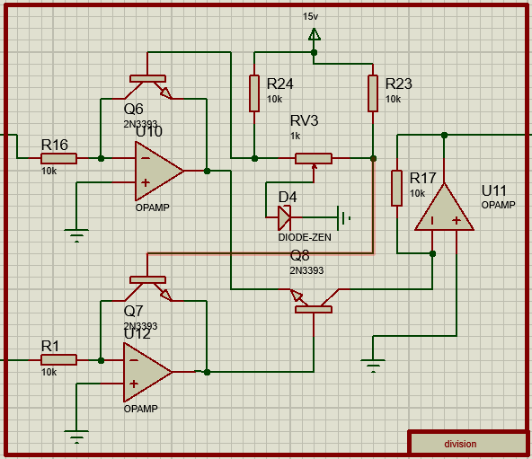

# Neural Network Hardware Simulation using Op-Amp Circuits

This project simulates a basic artificial neuron using hardware circuits designed with operational amplifiers (Op-Amps). The neuron model is based on a simple feedforward structure with a sigmoid activation function. The components required for this simulation include addition, multiplication, division, and sigmoid blocks.

## Project Overview

The project consists of the following main components:

- **Neuron Class**: A simple artificial neuron model is implemented with a sigmoid activation function.
- **Hardware Circuit**: A hardware-based circuit that mimics the neuron model, using Op-Amps for addition, multiplication, division, and sigmoid operations.
- **Simulation Outputs**: The simulation results are generated as text files and a 3D plot.

## Neuron Model

The neuron model is implemented in C++ as a simple class with a weight and bias. The class includes:

- A `sigmoid` function to compute the sigmoid of a given input.
- A `forward` function that performs the forward pass of the neuron, calculating the weighted sum of the inputs and applying the sigmoid activation.

### Code:
```cpp
class Neuron {
public:
    Neuron(double weight, double bias) : weight(weight), bias(bias) {}

    double sigmoid(double x) {
        return 1 / (1 + std::exp(-x));
    }

    double forward(double input) {
        double z = (input * weight) + bias;
        return sigmoid(z);
    }

private:
    double weight;
    double bias;
};
```

## Hardware Circuit Diagram

The hardware simulation is implemented using operational amplifier (Op-Amp) circuits. The circuit is divided into several blocks:

1. **Sum Block**: This block adds two inputs.


3. **Multiplication Block**: This block performs multiplication of inputs.


5. **Division Block**: This block divides one input by another.


7. **Sigmoid Block**: This block implements the sigmoid activation function.


These blocks are combined into a complete neuron circuit, which simulates the neuron’s behavior as described in the `Neuron` class.

### Circuit Diagram:


## Simulation Outputs

The Proteus simulation generates three key text files:

1. **input.txt**: Contains the input data fed to the neuron.
2. **weights.txt**: Contains the weights used for the neuron.
3. **output.txt**: Contains the output generated by the neuron after applying the weight and sigmoid function.

Additionally, a 3D plot of the neuron’s output is provided to visualize the relationship between the input and output.

### 3D Plot of Neuron Output:


## Running the Simulation

1. Clone the repository:
    ```bash
    git clone https://github.com/yourusername/neuron-hardware-simulation.git
    cd neuron-hardware-simulation
    ```

2. Set up the Proteus simulation with the appropriate circuit blocks for addition, multiplication, division, and sigmoid functions.

3. Run the simulation in Proteus to generate the output text files and the 3D plot.

4. Check the generated files:
    - `input.txt`: Contains input data for the neuron.
    - `weights.txt`: Contains the weights used in the simulation.
    - `output.txt`: Contains the output data after applying the sigmoid function.

5. View the output plot (`neuron_output_plot.png`) to analyze the results.

## Conclusion

This project demonstrates how to implement a simple artificial neuron model using hardware circuits, specifically Op-Amps. The simulation results can be used to study the behavior of neurons in hardware and gain insights into neural network operations at the circuit level.


